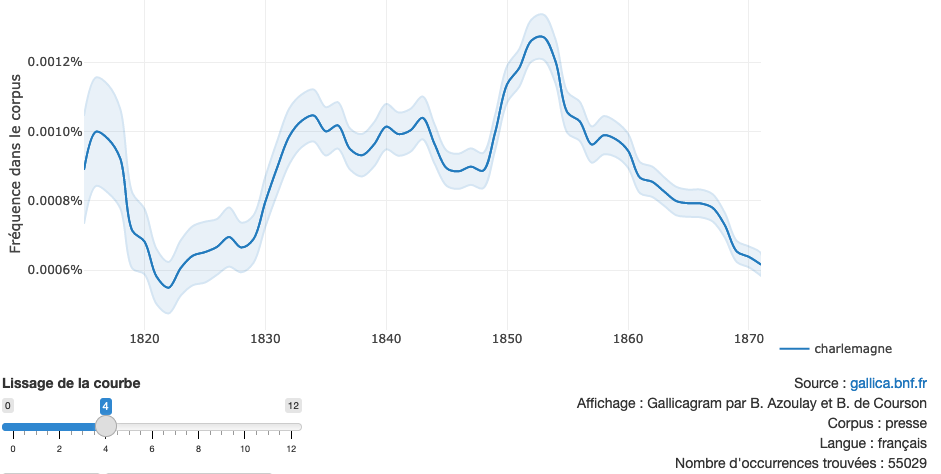

**Attention**, ce document est en cours de rédaction. Il s'agit d'une version de travail amenée à évoluer.

# Présentation du corpus

## Quel corpus pour quelles questions ? (Lola)

- Ce passage doit reprendre des éléments du DM du 26 mars sur la présentation du protocole de constitution du corpus.
- Il faut intégrer des graphiques obtenus sur Gallicagram et/ou Ngram Viewer.

## Explorer le corpus des mentions de Charlemagne dans le Journal des Débats (Tom)

- présenter l'environnement logiciel : R, RStudio, quanteda
- présenter le code qui permet d'importer le corpus du journal des débats 1815-1870
- décrire les principales caractéristiques du corpus (nombres de mots et d'occurrences) et la distribution des mots selon la temporalité

# La question de la temporalité

## Position du problème et méthodologie (Tom et Lola)

- Reprendre la question de la temporalité dans le corpus à travers la présentation de la démarche allant de la table lexicale à l'AFC
- Rappeler brièvement ce qu'est une AFC
- Présenter AnalyseSHS
- Nombre de facteurs à dépouiller
- Seuillage des modalités, modalités en supplémentaire...

### Dépouillement du 1er facteur (Enzo)

- Présenter les principaux éléments mis en avant par le 1er facteur.
- Il faut intégrer des retours au texte via l'utilisation de la fonction `kwic()` de quanteda par exemple.
- Possibilité aussi de revenir aux journaux sur Gallica.

### Dépouillement du 2e facteur (Alexandre)

- Présenter les principaux éléments mis en avant par le 2e facteur
- Il faut intégrer des retours au texte afin d'illustrer les observations faites via l'utilisation de la fonction `kwic()` de quanteda par exemple.
- Possibilité aussi de revenir aux journaux sur Gallica.

### Dépouillement du 3e facteur (Waldeck)

- Présenter les principaux éléments mis en avant par le 3e facteur
- Il faut intégrer des retours au texte afin d'illustrer les observations faites via l'utilisation de la fonction `kwic()` de quanteda par exemple.
- Possibilité aussi de revenir aux journaux sur Gallica.

# La question des genres journalistiques (selon le temps)

## Position du problème et méthodologie

## Principaux résultats
